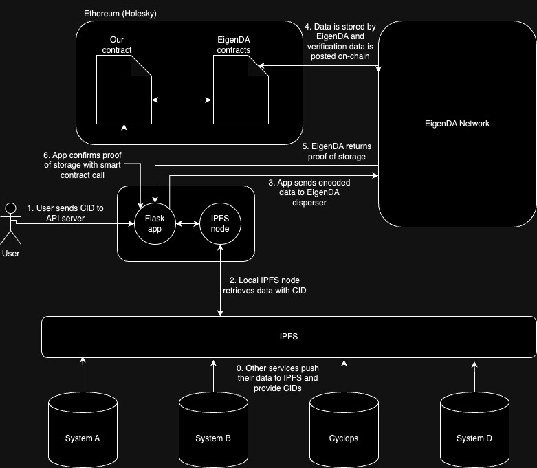

<!-- # EigenDA Exploration -->
# Carbon Credit Data Availability
This project aims to improve access to the biomass and deforestation data used in the determination of Verra-issued [Verified Carbon Standard](https://verra.org/programs/verified-carbon-standard/) (VCS) credits by providing a bridge from the original data sources to the EigenDA Data Availability network. This allows the trust implications of Ethereum staking to be extended to the storage and persistentence of carbon data, enabling downstream users to verify the data's quality or authenticity.

In this initial phase we are deploying on the Holesky Ethereum testnet. Here we provide a system for deploying verifier smart contracts,
requesting/downloading data from IPFS, dispersing that data to EigenDA's network, storing the resulting proof on-chain, verifying the proof on-chain, and retrieving the original data.

The README in the Holesky directory includes the instructions to run each part of the service.