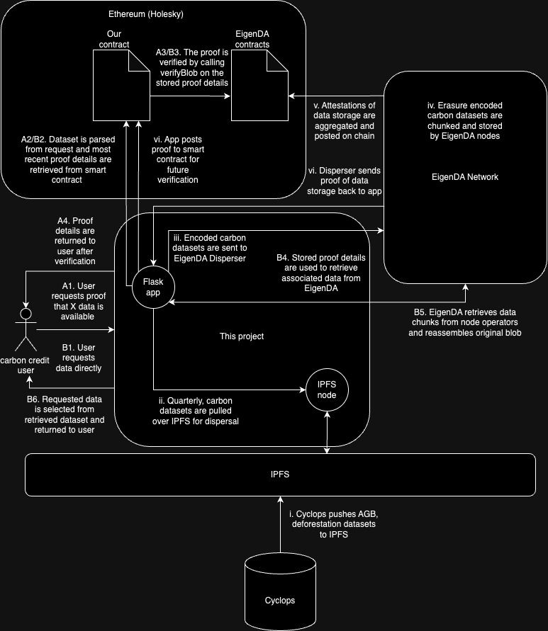

<!-- # EigenDA Exploration -->
# Carbon Credit Data Availability
This project aims to improve the process for assuring the quality of carbon data used in the issuance of Verra [Verified Carbon Standard](https://verra.org/programs/verified-carbon-standard/) (VCS) credits (the leading standard for carbon credits) by providing a simple interface for backing the original data sources with the [EigenDA](https://docs.eigenlayer.xyz/eigenda/overview) Data Availability network. 

Verra's VCS credits are determined transparently using high quality publicly available data (e.g. [AGB](), [deforestation]()) and according to their approved [methodologies](https://verra.org/methodologies-main/#vcs-program-methodologies). Records of credits and associated projects are maintained in the [Verra Registry](https://registry.verra.org/app/search/VCS). Using EigenDA for data availability allows the storage and persistence of the carbon credit process input data to benefit from the trust implications of Ethereum staking. Ultimately this provides better guarantees to downstream carbon credit users that the data used to determine the value of their products is available for audit.

In this initial phase we are using the Holesky Ethereum testnet. We provide code for deploying verifier smart contracts,
requesting/downloading data from IPFS, dispersing data to EigenDA's network, storing the resulting proof on-chain (uncompressed for now), verifying the proof on-chain, and retrieving the persisted data from EigenDA.

The README in the Holesky directory includes the instructions to run each part of the service.