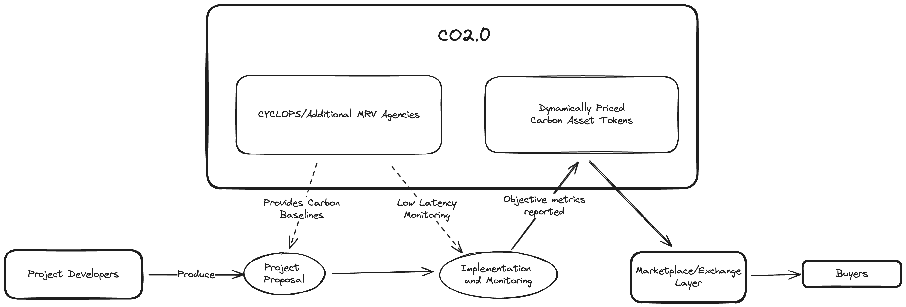
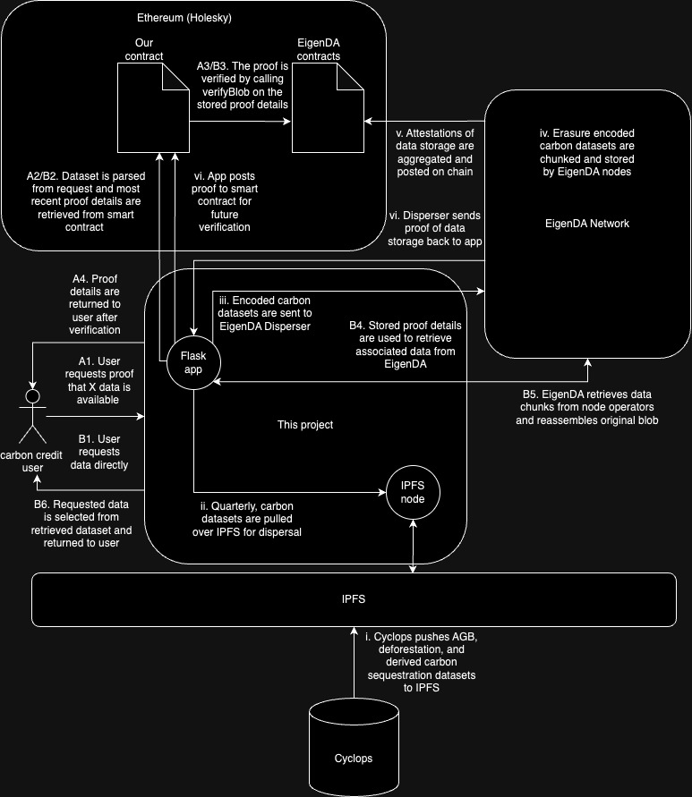

<!-- # EigenDA Exploration -->
# Data Availability Service for Emissions Reductions and Avoided Deforestation Monitoring	

## Background

The voluntary carbon market relies on the collaboration of numerous stakeholders. Agroforestry projects, in particular, demand coordination among developers, standards bodies, validators, verifiers, and ultimately, carbon credit buyers. Currently, agroforestry projects seeking accreditation often turn to standards bodies like the [Verified Carbon Standard](https://verra.org/programs/verified-carbon-standard/) (VCS) by the nonprofit organization Verra.

To achieve certification with a standards body, project developers must adhere to accepted [methodologies](https://verra.org/methodologies-main/#vcs-program-methodologies) in carbon accounting, such as Verra's VM0048. However, this process can prove frustrating for developers, as the determination of credit issuance often lacks transparency. The carbon credits certified by a standards body do not meet the expectations of the project developers for reasons unspecified by the body. Consequently, the credit issuance process appears opaque to market participants, rather than being transparent or formulaic.

This project aims to enhance the existing carbon credit issuance model by introducing a data availability layer that offers clear, objective carbon metrics monitored by CYCLOPS. These metrics can then be integrated into accounting methodologies to monitor emissions reductions and sequestration. The project utilizes measures such as Above Ground Biomass (AGB) and Forest Cover % for use in tracking forest health. By leveraging the CYCLOPS-produced AGB value, developers can easily calculate the total carbon stocks in any designated forest region using a straightforward formula in accordance with industry practicies. This empowers developers by providing them with the tools necessary to directly monitor the impact of their project interventions in ways consistent with existing methodologies.

## Use Case Description

Here we've provided a simple application dispersing CYCLOPS data to EigenDA. Using EigenDA for data availability allows the storage and persistence of CYCLOPS-produced data to benefit from the trust implications of Ethereum staking. These forestry datasets are updated quarterly, after which the new data can be pulled from IPFS and dispersed to EigenDA and the proofs updated on chain. This is designed to provide better guarantees to downstream carbon credit product users that the data used to determine the value of their products is available for audit.

In this initial phase we are using the Holesky Ethereum testnet. We provide code for deploying verifier smart contracts,
downloading data from IPFS, dispersing data to EigenDA's network, storing the proof on chain (uncompressed for now), verifying the proof on chain, and retrieving the data from EigenDA. The README in the Holesky directory includes the instructions to run each part of the service.

## CYCLOPS Data

For this use case, we are examining two forestry metrics from CYCLOPS: Forest Cover and Above Ground Biomass (AGB). More information can be found at the CYCLOPS application [API Reference](https://api.cyclops.ai/docs/api). The data are provided in [Zarr](https://zarr.dev/) format which is particularly suited for large-scale gridded data.

In the CYCLOPS data format, the Zarr files specify a grid of individual 100-meter by 100-meter squares (1 hectare), with each grid cell representing one "pixel". These files contain pixels corresponding to large swaths of global tropical forest. For each pixel, the AGB and Forest Cover variables are represented as single values corresponding to that real-world 100-meter by 100-meter location.

#### Forest Cover

The Forest Cover variable represents the proportion of the given region covered by forest canopy. This data is initially created at the 10-meter by 10-meter level as a binary value, which is then aggregated to the 100-meter by 100-meter level. Each 100-meter by 100-meter grid point in the Zarr file actually comprises a 10x10 grid of 10-meter by 10-meter subpixels. Each subpixel is categorized as either "forested" or "nonforested" by CYCLOPS. The Forest Cover value indicates the percentage of forest coverage, where a higher value denotes greater forest coverage. For example, a value of 78 means that 78% of the smaller subpixels are covered by the forest. This value can be utilized to monitor deforestation or afforestation over time, reflecting changes in forest health.

#### Above Ground Biomass (AGB)

The AGB value represents the total biomass of all living forest vegetation above soil level, measured in metric tons. Since each pixel corresponds to 1 hectare of covered forest, this value also represents the metric tons per hectare of above-ground biomass. For example, an AGB value of 680 at one pixel means that the total mass of above-ground biomass is 680 metric tons for that hectare.

AGB is a valuable metric when analyzed alongside Forest Cover. While Forest Cover indicates the _presence_ and location of forest vegetation, the AGB value indicates the biomass _quantity_. AGB can be directly converted into sequestered carbon if the ratio of carbon to total biomass is known. Many regions of the world have established ratios derived from scientific forestry studies. For example, in the Congo region, the formula is `sequestered_carbon = AGB * 0.47`

