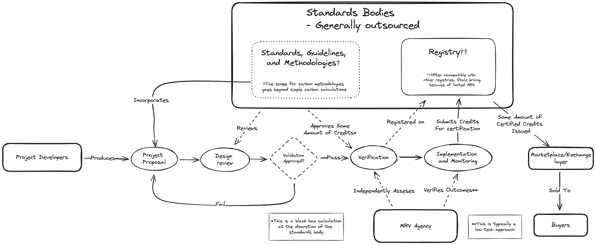

<!-- # EigenDA Exploration -->
# Data Availability Service for Emissions Reductions and Avoided Deforestation Monitoring	

## Background

The voluntary carbon market relies on the collaboration of numerous stakeholders. Agriforestry projects, in particular, demand coordination among developers, standards bodies, validators, verifiers, and ultimately, carbon credit buyers. Currently, agriforestry projects seeking accreditation often turn to standards bodies like the [Verified Carbon Standard](https://verra.org/programs/verified-carbon-standard/) (VCS) by the nonprofit organization Verra.

To achieve certification with a standards body, project developers must adhere to accepted [methodologies](https://verra.org/methodologies-main/#vcs-program-methodologies) in carbon accounting, such as Verra's VM0048. However, this process can prove frustrating for developers, as the determination of credit issuance often lacks transparency. The carbon credits certified by a standards body do not meet the expectations of the project developers for reasons unspecified by the body. Consequently, the credit issuance process appears opaque to market participants, rather than being transparent or formulaic.

This project aims to enhance the existing carbon credit issuance model by introducing a data availability layer that offers clear, objective carbon metrics monitored by CYCLOPS. These metrics can then be integrated into accounting methodologies to monitor emissions reductions and sequestration. The project utilizes measures such as Above Ground Biomass (AGB) and Forest Area % for use in tracking forest health. By leveraging the CYCLOPS-produced AGB value, developers can easily calculate the total carbon stocks in any designated forest region using a straightforward formula in accordance with industry practicies. This empowers developers by providing them with the tools necessary to directly monitor the impact of their project interventions in ways consistent with existing methodologies.

## Use Case Description

Here we've provided a simple application dispersing CYCLOPS data to EigenDA. Using EigenDA for data availability allows the storage and persistence of CYCLOPS-produced data to benefit from the trust implications of Ethereum staking. These forestry datasets are updated quarterly, after which the new data can be pulled from IPFS and dispersed to EigenDA and the proofs updated on chain. This is designed to provide better guarantees to downstream carbon credit product users that the data used to determine the value of their products is available for audit.

In this initial phase we are using the Holesky Ethereum testnet. We provide code for deploying verifier smart contracts,
downloading data from IPFS, dispersing data to EigenDA's network, storing the proof on chain (uncompressed for now), verifying the proof on chain, and retrieving the data from EigenDA. The README in the Holesky directory includes the instructions to run each part of the service.

